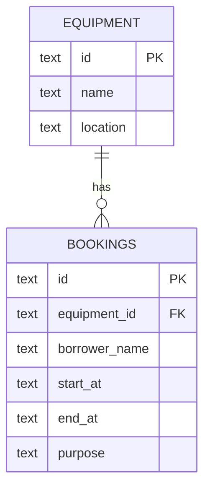

# Data Model

`equipment_id` references `equipment.id`, with SQLite foreign keys enabled. `start_at` and `end_at` are canonical UTC ISO strings; their lexical order matches chronological order. A database `CHECK` requires `start_at < end_at`. An index on `(equipment_id, start_at, end_at)` supports conflict checks. The local Node API checks for overlaps inside an immediate write transaction.

The Cloudflare D1 migration creates the same tables and index, seeds `eq-1` and `eq-2`, and adds `BEFORE INSERT` and `BEFORE UPDATE` triggers. The triggers reject an overlap atomically as `booking_overlap`; the Worker maps this to HTTP `409`. This avoids a race between a separate conflict query and the D1 write.
