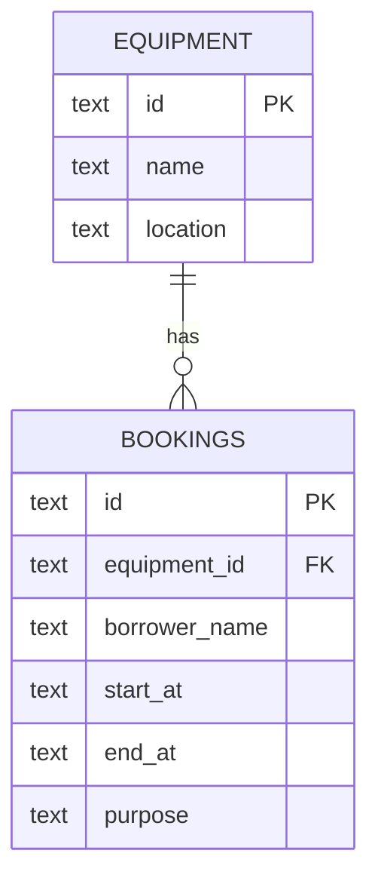

# Data Model

One equipment item can have many bookings. `bookings.equipment_id` references `equipment.id`. The database seeds `eq-1` (Projector A, Building 1) and `eq-2` (Camera B, Media Lab).

| Table | Key and constraints |
| --- | --- |
| `equipment` | `id` is the primary key; `name` and `location` are required. |
| `bookings` | `id` is the primary key; `equipment_id` is a required foreign key; borrower, times, and purpose are required. `CHECK (start_at < end_at)` rejects a reversed time range. |

Times are stored as canonical UTC ISO 8601 text with millisecond precision. In that format, text order matches time order. The index on `(equipment_id, start_at, end_at)` supports searching for conflicts.

Two bookings overlap for the same equipment when the existing start is before the proposed end **and** the existing end is after the proposed start. Equal endpoints are allowed: a booking can begin when another ends.

The local SQLite API checks this rule inside a `BEGIN IMMEDIATE` write transaction. The Cloudflare D1 migration adds `BEFORE INSERT` and `BEFORE UPDATE` triggers that reject an overlap during the write; the update trigger excludes the row being updated. The Worker converts the trigger error to HTTP `409`. The schema and seed SQL are in `migrations/0001_initial.sql`; the local schema setup is in `src/db.ts`.

Both APIs use bound SQL parameters for request values. The local SQLite file and the deployed D1 database are separate stores; local bookings are not copied to Cloudflare.
