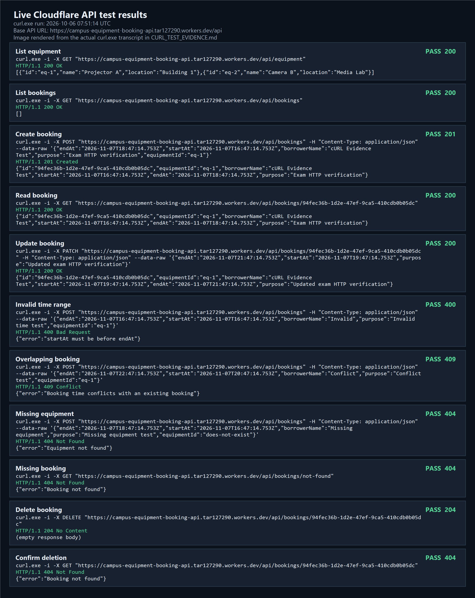

# Test Evidence

## Deployed API: live cURL run

**Base API URL:** `https://campus-equipment-booking-api.tar127290.workers.dev/api`  
**Run time:** 2026-10-06 07:51:14 UTC  
**Client:** `curl.exe` from PowerShell, using `scripts/curl-evidence.ps1`

The script sent real HTTP requests to the deployed Cloudflare Worker and checked each expected status. The [raw transcript](CURL_TEST_EVIDENCE.md) records every command, response headers, status, and body.

| Case | Request | Expected / actual | Response evidence |
| --- | --- | --- | --- |
| List equipment | `GET /equipment` | `200 / 200` | `eq-1` and `eq-2` returned |
| List bookings | `GET /bookings` | `200 / 200` | JSON array returned |
| Create | `POST /bookings` with valid data | `201 / 201` | Booking ID `94fec36b-1d2e-47ef-9ca5-410cdb0b05dc` returned |
| Read | `GET /bookings/:id` | `200 / 200` | Same booking ID and fields returned |
| Update | `PATCH /bookings/:id` with new times and purpose | `200 / 200` | Updated values returned |
| Invalid time | `POST /bookings` with equal start and end | `400 / 400` | `{"error":"startAt must be before endAt"}` |
| Overlap | `POST /bookings` overlapping the updated booking | `409 / 409` | `{"error":"Booking time conflicts with an existing booking"}` |
| Missing equipment | `POST /bookings` with an unknown `equipmentId` | `404 / 404` | `{"error":"Equipment not found"}` |
| Missing booking | `GET /bookings/not-found` | `404 / 404` | `{"error":"Booking not found"}` |
| Delete | `DELETE /bookings/:id` | `204 / 204` | Empty response body |
| Confirm deletion | `GET /bookings/:id` | `404 / 404` | `{"error":"Booking not found"}` |

The test booking was deleted. The result image below was rendered from the actual cURL transcript for easier reading. It is not a direct desktop screenshot.

## Other checks

- `npm test`: six automated test groups passed. They cover CRUD, invalid input, adjacent bookings, create and update conflicts, SQL-like text, and SQLite persistence after reopening the file.
- `npm run typecheck`: passed with no TypeScript errors.
- `node scripts/smoke.mjs` against the deployed Base API URL: 13 live HTTP cases passed, including an adjacent booking returning `201` and an update conflict returning `409`. Its test bookings were removed. The [raw run output](SMOKE_TEST_EVIDENCE.txt) records each result.
- `npm run db:migrate:local` and `npm run db:migrate:remote`: the D1 migration applied successfully to local and deployed databases.

To repeat the cURL run, use `pwsh -NoProfile -File scripts/curl-evidence.ps1`. It replaces the raw transcript with the new run and deletes its test booking. Then run `pwsh -NoProfile -File scripts/render-curl-evidence.ps1` to regenerate the image from that transcript.
